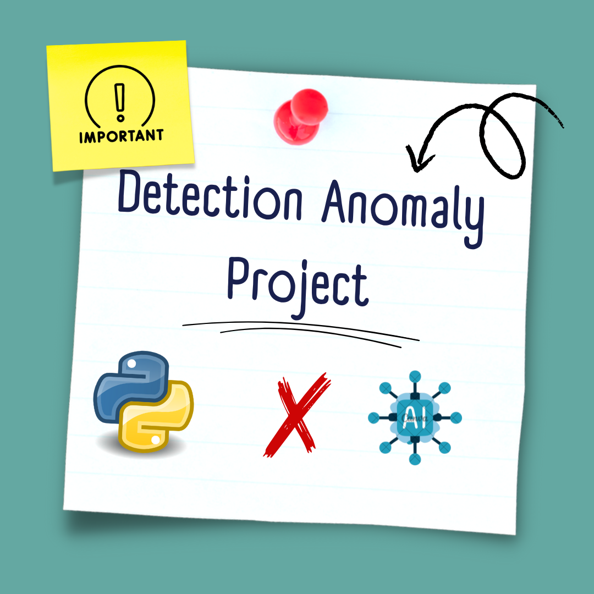

# 🛠️ Détection d'Anomalies à l'aide du Deep Learning

🔗 [Accéder aux Data sur Google Drive](https://drive.google.com/file/d/1etqMok3535rsBWnRMPAfaqpEWUhtE-_8/view?usp=drive_link)




Ce projet vise à détecter des anomalies dans les images en utilisant des modèles de deep learning. Le projet utilise le **Anomaly Detection Dataset** pour entraîner et tester des architectures avancées.


## 🧐 Description
L'objectif principal de ce projet est de détecter des comportements ou objets anormaux dans des Images de piétons, tels que :
- ❗ Des comportements atypiques  

Les anomalies sont identifiées en entraînant le modèle sur des comportements normaux pour détecter les écarts.

---

## 💻 Technologies
Voici les outils et bibliothèques utilisés :
- 🐍 **Python** (3.x)
- 🔧 **TensorFlow** / **PyTorch**
- 🎥 **OpenCV** pour le traitement vidéo
- 📊 **NumPy** et **Pandas** pour la manipulation des données
- 📈 **Matplotlib** pour la visualisation des résultats

---

## 📂 Données
Le projet utilise le **UCSD Anomaly Detection Dataset**, qui contient deux sous-ensembles :
- **Cable** : 223 Images pour l'entraînement et 223 pour les tests
- **Grid** : 216 Images pour l'entraînement et 216 pour les tests
- **Screw** : 320 Images pour l'entraînement et 320 pour les tests
- Annotations avec des drapeaux binaires pour identifier les anomalies
- Quelques masques binaires pixel-level pour la localisation

---

## 🏗️ Architecture
Les modèles testés incluent :
1. 🧠 **3D Convolutional Neural Network (3D CNN)** : pour capturer les variations spatiales et temporelles.
2. 🔄 **Autoencodeur Convolutionnel (CAE)** : pour la reconstruction des frames normales et l'identification des anomalies par erreur de reconstruction.

---

## ⚙️ Installation

1. Clonez ce dépôt :
   ```bash
   git clone https://github.com/NadhirBenOthmen/anomaly-detection.git
   cd anomaly-detection

---

## 📊 Ressources supplémentaires

Pour accéder aux ressources supplémentaires liées à ce projet, vous pouvez consulter le lien Google Drive ci-dessous :

🔗 [Accéder aux Data sur Google Drive](https://drive.google.com/file/d/1etqMok3535rsBWnRMPAfaqpEWUhtE-_8/view?usp=drive_link)

---


## 📬 Contact
Pour toute question, contactez-moi :
- 📧 Email : [nadhir.benothmen@esprit.tn](mailto:nadhir.benothmen@esprit.tn)
- 🔗 LinkedIn : [Votre Profil LinkedIn](https://www.linkedin.com/in/nadhir-ben-othmen-a58604202/)


